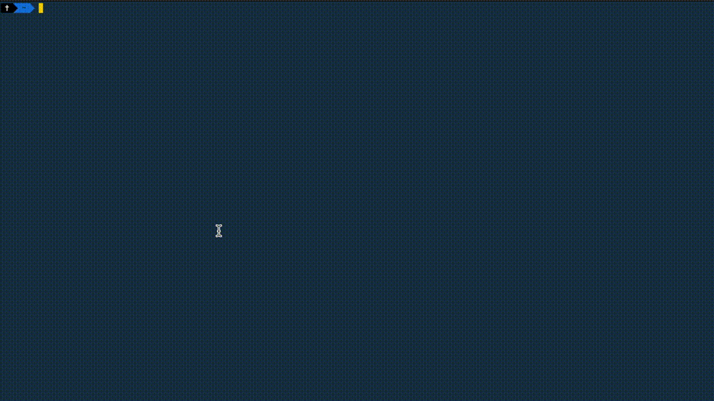

# PizzaLang

This is about a new programming language called PizzaLang. Idea here is to explore implementing a new programming language.



## Prerequisites

- C/C++ Compiler ([CLang](https://clang.llvm.org/) is preferred)
- [CMake](http://cmake.org/)
- [Make](https://www.gnu.org/software/make/)
- [LLVM](https://llvm.org)

## Compile the compiler (bake)

```
cd build
cmake ..
make
```

`bake` should be available at `build/bin` folder.

## Builtin Keywords

| Keyword      | Description                                                                  | Example                                                      |
| ------------ | ---------------------------------------------------------------------------- | ------------------------------------------------------------ |
| base         | Similar to `function` in other programming languages it declares a function  | `base inc(x) x + 1;`                                         |
| topping/in   | Similar to `var` it delcares a variable                                      | `topping x = 1 in print(x);`                                 |
| sauce        | Similar to `extern` it allows access to members declared in libs             | `sauce print(x);`                                            |
| if/then/else | Control flow, jumps depending on condition                                   | `if x < 3 then print(0) else print(x);`                      |
| for/in       | Control flow loops depending on condition                                    | `for i=0, i<5 in print(i);`                                  |
| binary       | Allows creation of custom binary operators                                   | `base binary\| 5 (L R) if L then 1 else if R then 1 else 0;` |
| unary        | Allows creation of custom unary operators                                    | `base unary!(v) if v then 0 else 1;`                         |

## Builtin Operators

| Operator | Description                                                                  | Example                                               |
| -------- | ---------------------------------------------------------------------------- | ----------------------------------------------------- |
| `=`      | Sets a topping (variable) or an argument's value                             | ```base test(x) x = 1;``` or ```topping x = 1;```     |
| `<`      | Compare numbers return either 0, 1                                           | ```10 < 5;```                                         |
| `+`      | Adds numbers                                                                 | ```1 + 2;```                                          |
| `-`      | Subtracts numbers                                                            | ```1 - 2;```                                          |
| `*`      | Multiplys numbers                                                            | ```1 * 2;```                                          |
| `/`      | Divides numbers                                                              | ```1 / 2;```                                          |
| `()`     | Lists args in bases (functions) and can change order of precedence           | ```base test(x) x = 1;``` or ```(1 + 2) * 3```        |
| `{}`     | Scopes, allows you to add groups of statements                               | ```{ topping x = 1; x = x + 1; print(x); }```         |

## Notes

- This code has been crafted following the examples from https://llvm.org/docs/tutorial/MyFirstLanguageFrontend.
- It does not use any engineering good practices and it certainly does not reflect my personal style of coding.
- You can find many pizza program examples in the `examples` folder.
